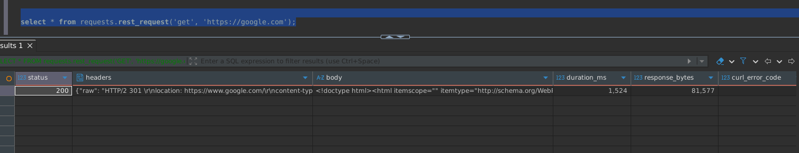
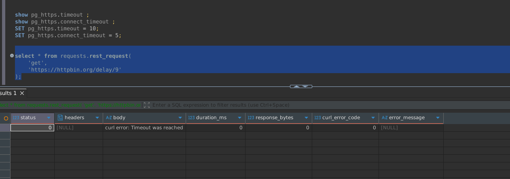
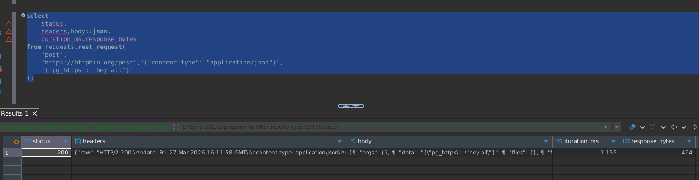
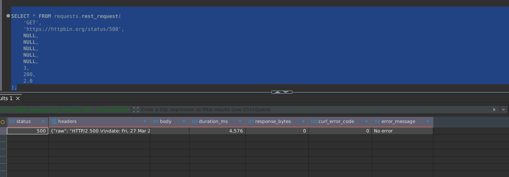

# pg_https

`pg_https` is a PostgreSQL extension that enables making HTTP/HTTPS requests directly from SQL using libcurl.

It is designed to be lightweight, configurable, and safe for use inside PostgreSQL, with support for timeouts, retries, and response size limits.

---

## Project Structure

```
pg_https/
│
|---- src/
│   |---- pg_https.c
│   |---- https_core.c
│   |---- https_core.h
│   |---- (*.so , *.o , *.bc files will be here)
|---- sql/
│   |---- pg_https--1.0.sql (contains mainly func, GUC config vars)
│
|---- .gitignore ( ignore generated files )
|---- Makefile
|---- pg_https.control
|---- build.sh
|---- readme.md
```


---

## How It Works

```
SQL call --> rest_request() --> https_execute() --> libcurl --> response buffers (body + headers) --> https_result struct --> PostgreSQL tuple --> SQL result

```


---

## Installation

### 1. Build

```bash
./build.sh
```
or 

```
make clean
make cc=gcc VERBOSE=1
make install
```

2. Enable Extension

Add in postgresql.conf:

```
shared_preload_libraries = 'pg_https'

```

Restart PostgreSQL.


3. Create Extension
```sql
SELECT * FROM pg_extension; -- CHECK WHETHER THIS EXTENSION EXISTS

DROP EXTENSION IF EXISTS pg_https CASCADE ;

CREATE EXTENSION pg_https;

SHOW pg_https.timeout;
SHOW pg_https.connect_timeout;

SET pg_https.timeout = 50;
SET pg_https.connect_timeout = 30;


set pg_https.tls_version = 12;
set pg_https.verify_peer = false;

SET pg_https.default_headers = '{"User-Agent": "pg_https/1.0","Content-Type":"application/json"}';

set pg_https.max_response_size = 10485760 ; -- 10 MB

```


4. Params

Available Parameters
Parameter	                |   Description Default
----------------------------|-----------------------------
pg_https.timeout	        |   Total request timeout (seconds)	10
pg_https.connect_timeout	|   Connection timeout (seconds)	5
pg_https.tls_version        |   TLS version (0=default, 12=TLS1.2, 13=TLS1.3)	0
pg_https.verify_peer        |   Enable SSL verification	true
pg_https.max_response_size  |   Max response size (bytes)	10MB
pg_https.default_headers    |   Default headers (JSON)	""


SQL API Function
```sql
requests.rest_request(
    method TEXT,
    url TEXT,
    headers JSONB DEFAULT NULL,
    body TEXT DEFAULT NULL,
    timeout INT DEFAULT NULL,
    username TEXT DEFAULT NULL,
    password TEXT DEFAULT NULL,
    retries INT DEFAULT 0,
    retry_delay_ms INT DEFAULT 100,
    retry_backoff FLOAT DEFAULT 2.0
)
Return Type
CREATE TYPE http_response AS (
    status int,
    headers jsonb,
    body text,
    duration_ms int,
    response_bytes int,
    curl_error_code int,
    error_message text
);
```

For POST and GET there exists wrapper function as well
```sql
-- POST
requests.post_request(
    url TEXT,
    headers JSONB DEFAULT NULL,
    body TEXT DEFAULT NULL,
    timeout INT DEFAULT NULL,
    username TEXT DEFAULT NULL,
    password TEXT DEFAULT NULL,
    retries INT DEFAULT 0,
    retry_delay_ms INT DEFAULT 100,
    retry_backoff FLOAT DEFAULT 2.0
)
Return Type
CREATE TYPE http_response AS (
    status int,
    headers jsonb,
    body text,
    duration_ms int,
    response_bytes int,
    curl_error_code int,
    error_message text
);

-- GET
requests.get_request(
    url TEXT,
    headers JSONB DEFAULT NULL,
    body TEXT DEFAULT NULL,
    timeout INT DEFAULT NULL,
    username TEXT DEFAULT NULL,
    password TEXT DEFAULT NULL,
    retries INT DEFAULT 0,
    retry_delay_ms INT DEFAULT 100,
    retry_backoff FLOAT DEFAULT 2.0
)
Return Type
CREATE TYPE http_response AS (
    status int,
    headers jsonb,
    body text,
    duration_ms int,
    response_bytes int,
    curl_error_code int,
    error_message text
);
```


---

Examples

Simple GET
```sql
SELECT * FROM rest_request(
    'GET',
    'https://httpbin.org/get'
);
```


Timeout Test
```sql
SELECT * FROM requests.rest_request(
    'GET',
    'https://httpbin.org/delay/9'
);
```
output:-




*(be careful while setting timeout and connection_timeout values)*


POST Request
```sql
SELECT * FROM requests.rest_request(
    'POST',
    'https://httpbin.org/post'
);
```

POST with JSON
```sql
select 
    status, 
    headers,body::json,
    duration_ms,response_bytes
from requests.rest_request(
    'post',
    'https://httpbin.org/post','{"content-type": "application/json"}',
    '{"pg_https": "hey all"}'
);
```
output



With wrapper func available
```sql
SELECT 
    status,
    headers,
    body::json,
    duration_ms,
    response_bytes
FROM requests.post_req(
    'https://httpbin.org/post',
    '{"Content-Type": "application/json"}',
    '{"hello": "world"}'
);
```


Retry with Exponential Backoff
```sql
SELECT * FROM requests.rest_request(
    'GET',
    'https://httpbin.org/status/500',
    NULL,
    NULL,
    NULL,
    NULL,
    NULL,
    3,
    200,
    2.0
);

```



## Features
- Supports GET, POST, PUT, DELETE, PATCH
- JSON-based headers
- Configurable timeouts
- TLS version control (TLS 1.2 / 1.3)
- SSL verification toggle
- Response size limiting
- Retry with exponential backoff
- Idempotent request safety
- Interrupt-safe (supports cancel / statement_timeout)
- HTTP/2 and compression support

## Notes
- Retries happen only for:
  - Network failures
  - HTTP 5xx responses
- Retries are applied only to idempotent methods
- Requests are synchronous (blocking)
- Response size is capped via GUC

## Limitations
- No async support
- No connection pooling (yet)
- No background job queue

## Expected Future Improvements
- Connection reuse / pooling
- Async execution
- Background workers
- Structured error JSON

---

## TESTED
- Debian , PostgresSQL 17 : works smoothly
- WSL Ubuntu 24.04 LTS : works , may require to download and make of curl 8.14.0

---

**Note:** This code may produce C90 warnings because some variables are declared and initialized in a single statement, which is not strictly compliant with the C90 standard.
```c
-- may trigger warning in c90
int x = 5;
-- c90 prefers 
int x ;
x = 5;
```